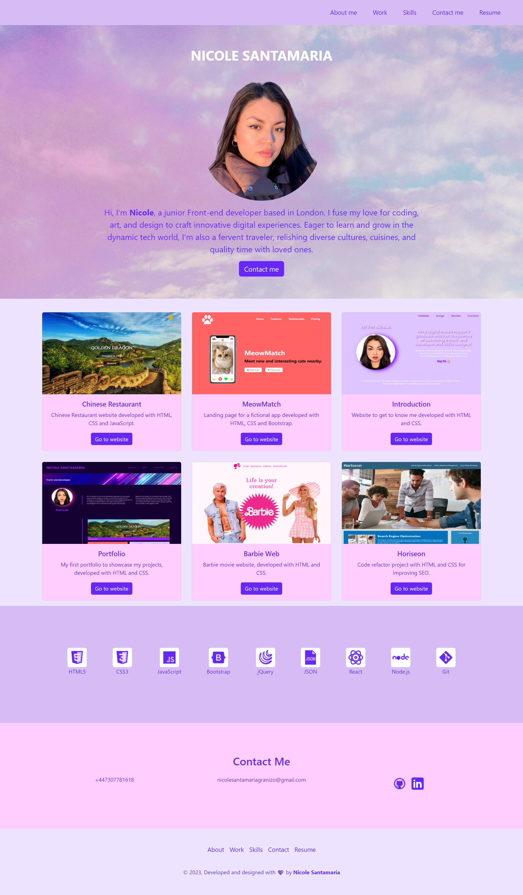
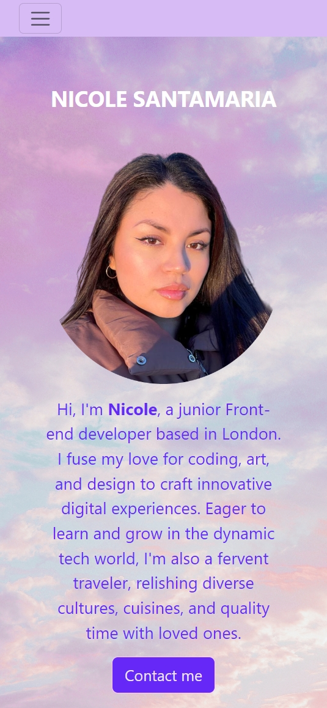
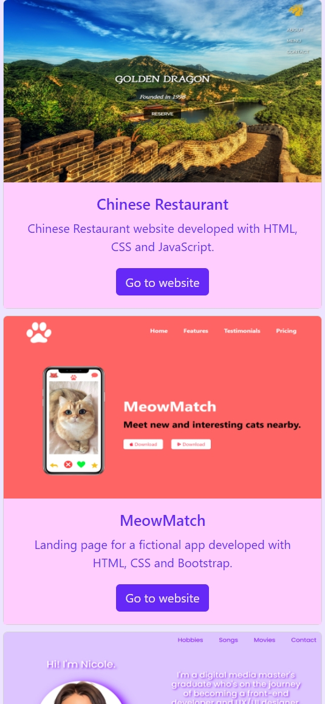
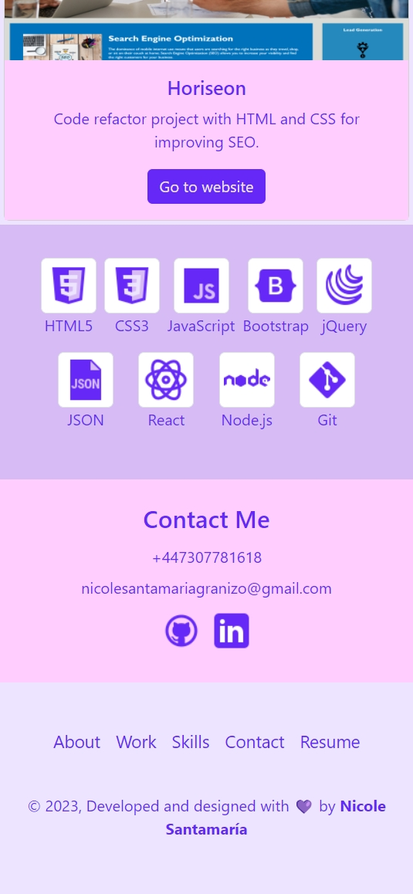

# Nicole Santamaría Bootstrap Portfolio

This project serves as my portfolio, designed to showcase the programming and design skills I've acquired through my previous studies and during the Bootcamp implementing the Bootstrap Framework.

## Usage

Deployed portfolio URL: https://nicolesang.github.io/Bootstrap-portfolio/

- This image displays the portfolio's desktop view. To navigate to specific sections (About Me, Work, Contact), click on the respective options in the navigation bar located at the top right corner. 
- Additionally, you can access my resume in PDF format by clicking on "Resume." 
- Click on any the "Go to website" buttons in the Work section to open the deployed projects in a new window.
- The thumbnail images in the Skills section showcase the skills I will have by the end of the Bootcamp.
- The menu located in the footer provides the same functionalities as the navigation bar at the top.
- For a closer look at my GitHub and LinkedIn profiles, click on the corresponding logos in the Contact Me section.

- These images showcases the portfolio's appearance on smaller screens, such as mobile phones. The navigation functions in the same way as it does on the desktop view.
- The menu will be displayed when the hamburger menu in the top-left corner is clicked.

## Credits

- Hero image: https://unsplash.com/photos/white-clouds-and-blue-sky-during-daytime-pr0I-DUB5eA?utm_content=creditShareLink&utm_medium=referral&utm_source=unsplash
- Icons: https://icons8.com/icons

## License
MIT License

Copyright (c) [2023] [Karen Nicole Santamaria Granizo]

Permission is hereby granted, free of charge, to any person obtaining a copy
of this software and associated documentation files (the "Software"), to deal
in the Software without restriction, including without limitation the rights
to use, copy, modify, merge, publish, distribute, sublicense, and/or sell
copies of the Software, and to permit persons to whom the Software is
furnished to do so, subject to the following conditions:

The above copyright notice and this permission notice shall be included in all
copies or substantial portions of the Software.

THE SOFTWARE IS PROVIDED "AS IS", WITHOUT WARRANTY OF ANY KIND, EXPRESS OR
IMPLIED, INCLUDING BUT NOT LIMITED TO THE WARRANTIES OF MERCHANTABILITY,
FITNESS FOR A PARTICULAR PURPOSE AND NONINFRINGEMENT. IN NO EVENT SHALL THE
AUTHORS OR COPYRIGHT HOLDERS BE LIABLE FOR ANY CLAIM, DAMAGES OR OTHER
LIABILITY, WHETHER IN AN ACTION OF CONTRACT, TORT OR OTHERWISE, ARISING FROM,
OUT OF OR IN CONNECTION WITH THE SOFTWARE OR THE USE OR OTHER DEALINGS IN THE
SOFTWARE.

## Badges

